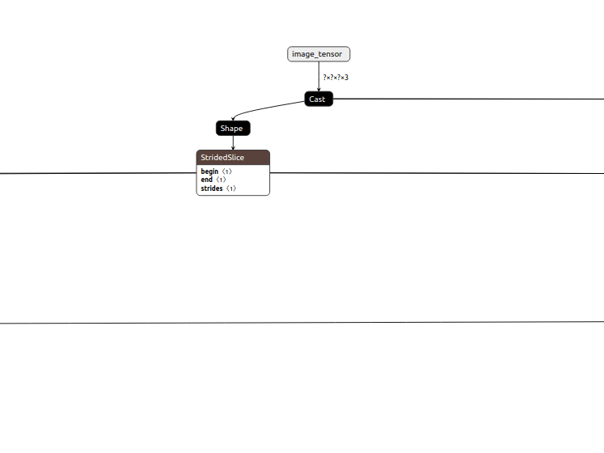
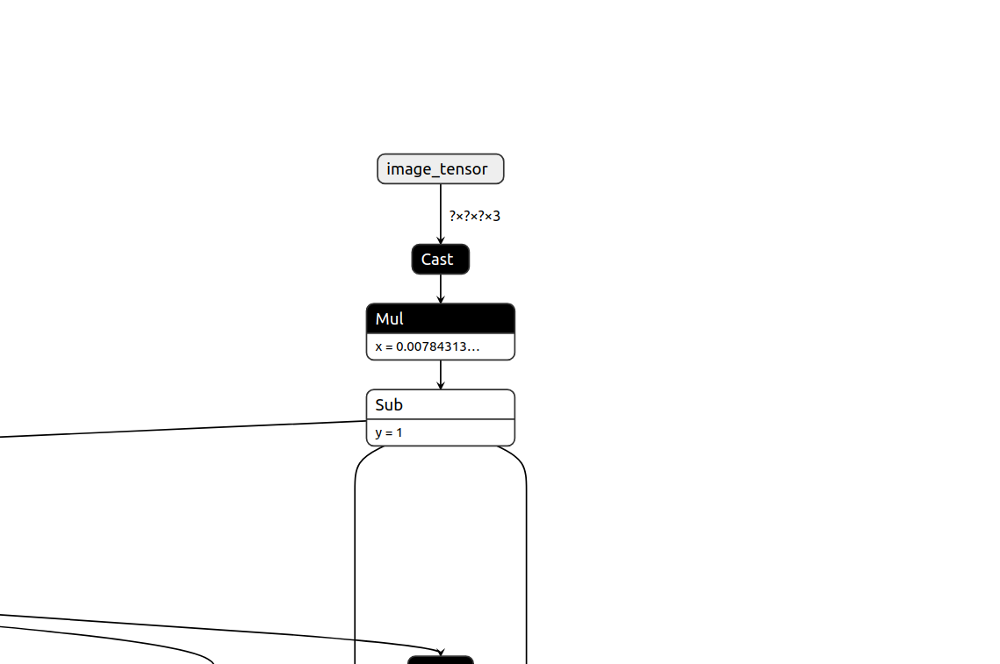
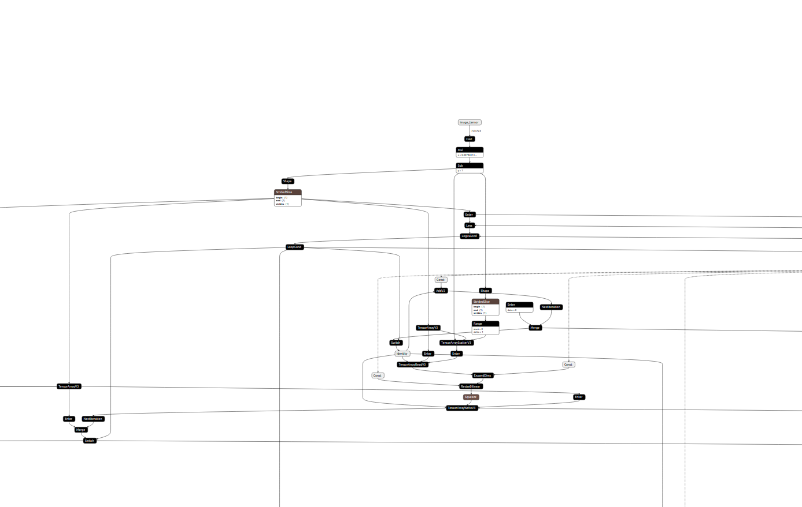

### Difference between ssdlite transfer learned model and original model.

* Here the original ssd lite model resizes the image to 300 x 300 and then normalizes that output image with 127.5. And the proof of this application can be available from the official caffe repo of ssd lite also from [here](https://github.com/chuanqi305/MobileNetv2-SSDLite/blob/master/demo_caffe.py#L33)

  

* There's no clarity on what preprocessing is being applied on transfer learning since it's only dividing the image with 127.5 and substracting one from it.

  

* Even to inspect what preprocessing is applied on it, the node structure in transfer learned image is a bit confusing to deduce.

  

